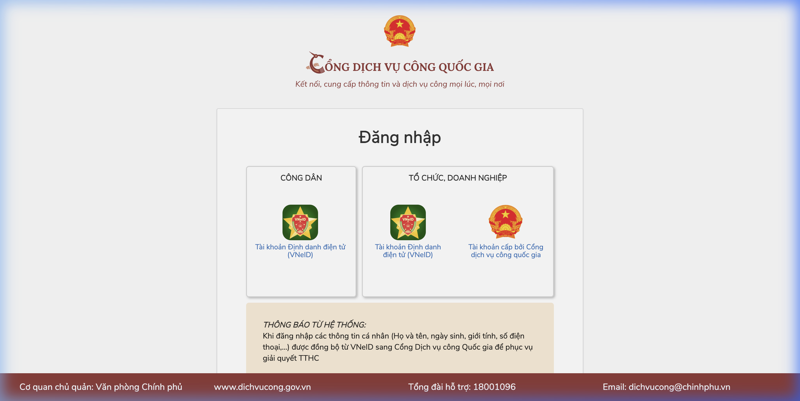

# Hướng Dẫn Sử Dụng Extension "Dịch Vụ Công Automator"

Tiện ích mở rộng này được thiết kế để giúp bạn tự động điền danh sách lưu trú vào hệ thống Dịch vụ công Quốc gia từ file dữ liệu Google Sheet.

## 1. Cài đặt tiện ích vào Chrome
Vì đây là tiện ích dùng nội bộ, bạn cần cài đặt thủ công (Unpacked extension) theo các bước sau:

1. Mở trình duyệt Google Chrome (hoặc Cốc Cốc, Edge, Brave...).
2. Truy cập vào trang quản lý Tiện ích: Gõ `chrome://extensions/` vào thanh địa chỉ và ấn Enter.
3. Nhìn sang góc **trên cùng bên phải**, bật công tắc **Chế độ dành cho nhà phát triển** (Developer mode).
4. Sẽ có 3 nút mới hiện ra ở góc trên bên trái. Bấm vào nút **Tải tiện ích đã giải nén** (Load unpacked).
5. Khung chọn thư mục hiện ra, bạn hãy trỏ tới thư mục `dichvucong_extension` nằm tại đường dẫn: 
   `/Users/sonpc/Documents/GitHub/DKTTTV/dichvucong_extension`
   Và chọn **Select Folder** (hoặc Open/Chọn).
6. Tiện ích "Dịch Vụ Công Automator" sẽ xuất hiện trong danh sách. Bạn có thể bấm vào biểu tượng "Mảnh ghép" (tượng trưng cho Extension) góc phải trên cùng trình duyệt và ghim (Pin) nó ra ngoài để dễ bấm.

## 2. Chuẩn bị dữ liệu (File CSV)
1. Mở file [Google Sheet Data](https://docs.google.com/spreadsheets/d/1fFdJDORwXDZhOwsHNLBwi3C6r0jK8NbVeGJLOB9ZgBk/edit?gid=1129675994#gid=1129675994) của bạn.
2. Chọn Sheet **Data**.
3. Bấm vào **Tệp (File)** > **Tải xuống (Download)** > **Giá trị được phân tách bằng dấu phẩy (.csv)**.
4. Một file đuôi `.csv` sẽ được tải về máy của bạn.

## 3. Khởi chạy tự động hoá
1. Truy cập vào trang [Dịch vụ công - Thông báo lưu trú](https://dichvucong.dancuquocgia.gov.vn/portal/p/home/thong-bao-luu-tru.html?ma_thu_tuc=2.001159).
2. Đăng nhập bằng tài khoản **VNeID** của bạn để vào tới màn hình có thể "Thêm người lưu trú" thành công.

   

3. Bấm vào **biểu tượng của Extension** Dịch Vụ Công Automator trên góc trình duyệt.
4. Trong cửa sổ hiện ra, bấm **Chọn file (Choose File)** và tìm đến file `.csv` bạn vừa tải về ban nãy.
5. Lúc này công cụ sẽ đọc toàn bộ các dòng có chứa tên trong file CSV.
6. Bấm nút **Bắt đầu Nhập**. 
7. Tiện ích sẽ tự động quét, tìm form đăng ký, điền Họ Tên, CCCD, Lý do (Tu học) và bấm "Lưu lại". Bạn chỉ cần ngồi xem cho đến khi hoàn thành toàn bộ.

---

**Lưu ý:**
- Nếu bạn muốn dừng tự động để kiểm tra tay, bấm vào icon extension và bấm **Dừng**.
- Web Dịch vụ công có thể thay đổi thiết kế các nút (Thêm mới, Lưu) trong tương lai. Nếu lúc chạy tool không tự click được, bạn có thể tự thao tác bấm click thay tool ở các bước không tìm thấy (tool vẫn tự điền chữ vào ô được). Khi đó hãy nhắn để tôi cập nhật mã nguồn (nếu cần).
